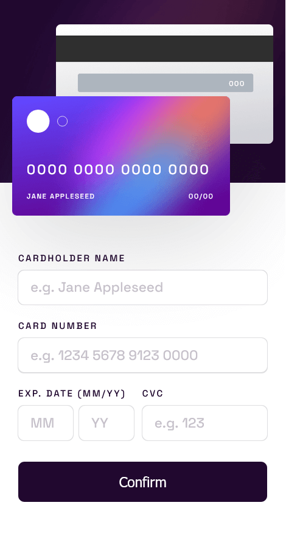

# Frontend Mentor - Interactive card details form solution

This is a solution to the [Interactive card details form challenge on Frontend Mentor](https://www.frontendmentor.io/challenges/interactive-card-details-form-XpS8cKZDWw). Frontend Mentor challenges help you improve your coding skills by building realistic projects.

## Table of contents

- [Overview](#overview)
  - [The challenge](#the-challenge)
  - [Screenshots](#screenshots)
  - [Links](#links)
- [My process](#my-process)
  - [Built with](#built-with)
  - [What I learned](#what-i-learned)
  - [Continued development](#continued-development)
  - [Useful resources](#useful-resources)
- [Author](#author)

## Overview

### The challenge

Users should be able to:

- Fill in the form and see the card details update in real-time
- Receive error messages when the form is submitted if:
  - Any input field is empty
  - The card number, expiry date, or CVC fields are in the wrong format
- View the optimal layout depending on their device's screen size
- See hover, active, and focus states for interactive elements on the page

### Screenshots

## Mobile

## Desktop

### Links

- Solution URL: [https://github.com/mihalymarcell86/interactive-card-details-form](https://github.com/mihalymarcell86/interactive-card-details-form)
- Live Site URL: [https://interactive-card-details-form-psi.vercel.app/](https://interactive-card-details-form-psi.vercel.app/)

## My process

### Built with

- Semantic HTML5 markup
- Sass, [CSS Modules](https://github.com/css-modules/css-modules)
- Mobile-first workflow
- [React](https://reactjs.org/)

### What I learned

Controlled vs. Uncontrolled Components:

Refs would have been handy, because I could have used the Contraint Validation API to evaluate the form inputs, but I soon ran into some walls with them, so I decided to use controlled inputs instead. Though, it requires more coding, it is much more flexible.

Gradient outlines:

Creating the active states for the input fields proved to be quite challenging. `border-image` is unfortunately incompatible with `border-radius`, so I had to come up with a hack. This is the fist time, however, that `:focus-within` came to the rescue.

### Useful resources

- [Gosha Arinich - Controlled and uncontrolled form inputs in React don't have to be complicated](https://goshacmd.com/controlled-vs-uncontrolled-inputs-react/) - This article gave me some guidelines for deciding between controlled and uncontrolled inputs.

## Author

- GitHub - [@mihalymarcell86](https://github.com/mihalymarcell86)
- Frontend Mentor - [@mihalymarcell86](https://www.frontendmentor.io/profile/mihalymarcell86)
